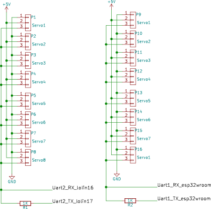

# Robonova robot control

[Back to the main page](readme.md)

## Acknowledgements 

Robonova is a robot from the year 2008. The original control platform (MR-C3024) is an Atmega platform controlled with Basic as higher language.
It is a nice control platform, but has its limits.

Robonova consists of 16 special designed servos. Each servo can be controlled with standard pulse, extended pulse or hmi.
See: https://robosavvy.com/Builders/i-Bot/HSR8498HB%20Servo.pdf

More info about the hmi here: http://robosavvy.com/Builders/i-Bot/HSR8498_serial.pdf

and here:
http://www.iri.upc.edu/files/scidoc/1186-Slave-architecture-for-the-Robonova-MR-C3024-using-the-HMI-protocol-IRI-Technical-Report.pdf

## Goal

* Short term: I try to control the robonova via HMI, using a lolin32 with micropython as platform. Status: fully working! 
* Longer term: control Robonova via ROS. Create a ROS driver for the the Robonova

## Firmware modification

To control the servos directory, without extra electronics, the uart RX and TX must be inverted. The underlying esp-idf platform does support inverting the signals.

Add next lines to function machine_uart_init_helper in machine_uart.c:

    if (args[ARG_inv].u_int > 0){
        uint32_t mask = (1 << 22 ) | (1<< 19);
        uart_set_line_inverse(self->uart_num, mask);
    }
    // set data bits

And modify:

    static const mp_arg_t allowed_args[] = {
        { MP_QSTR_baudrate, MP_ARG_INT, {.u_int = 0} },
        { MP_QSTR_inv, MP_ARG_INT, {.u_int = 0} },
        { MP_QSTR_bits, MP_ARG_INT, {.u_int = 0} },

Note that line with MP_QSTR_inv is added.

Rebuild and flash the new firmware.

## Servo connection:

* Connect the data line of the servo to RX of uart2 (pin 16 on lolin32)
* Connect the data line of the servo with an 1K resistor to TX of uart2 (pin 17 on lolin32) 

The effect is that the esp32 can send frames via TX and the 1k resitor.
While receiving data the esp32 will transmit 2 zeros, effectivly creating a pullup resistor (note that TX is inverted!)

# Testing
* Connect up to  3 servo's to uart2.
* Run test /test/lib/test_hitecservo.py

# Servo control app:
* A web app is available to control all 16 servo's of the robonova
* see /app/robonova
* status: work in progress, working, but not finished yet

## Communication with ROS

The app rosserver makes the robonova controlled by ROS

rosserver does act as a server. On the PC (or the raspberry PI) a robonova ros driver should connect to the server.

Information is transferred with an API based on low level frames.

Command frame format:

    byte 0: 'R'   # start of frame marker 1
    byte 1: 'o'   # start of frame marker 2
    byte 2: command
    byte 3: size
    byte 4: start of data array

Most commands are async: no response is expected.
Only command GET_STATUS is synchronous and waits for a response

Response frame format:

    byte 0: 'R'   # start of frame marker 1
    byte 1: 'o'   # start of frame marker 2
    byte 2: status:         0x10 = ROBONOVA_OK
    byte 3: nr of motors
    byte 4: voltage in mV high
    byte 5: voltage in mV low
    byte 4: amperage in mA high
    byte 5: amperage in mA low
    Byte 6: position array, 2 bytes per motor. Position in servo pulse lenght 500..2500 ms, 1500 is mid position

Possible commands:

    SET_POSITION 0x10      data array of unsigned short (2 bytes) contains position of servo (500 .. 2500). If a data field is zero, the position is not changed, no update.
    SET_SPEED    0x20      data array of unsigned byte  (1 bytes) contains speed of servo (1 .. 255). I data field is zero, speed is not changed, no update
    SET_TORQUE   0x30      data array of unsigned byte  (1 bytes) contains torque of servo (1 .. 3). I data field is zero, torque is not changed, no update
    SET_OFF    0x40        No param. Remove power from the servos. Motors can be moved by hand 
    SET_MOTORSTOP 0x50     Stop motors form moving but keep powered. 
    GET_STATUS   0x80      only after command GET_STATUS the ROBONOVA will reply 

